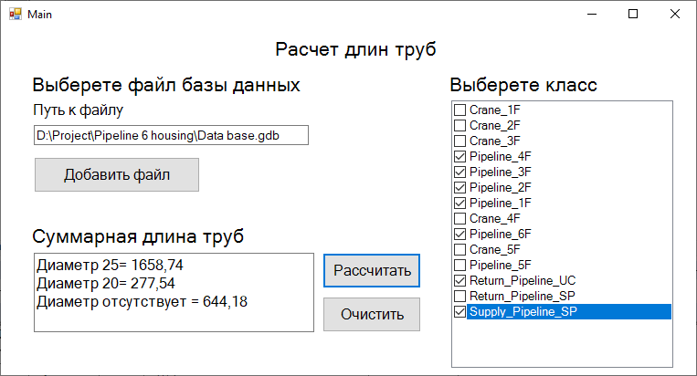

# ModulForArcGIS

# Разработка инструментальной модульной надстройки, интегрируемой под программное обеспечение ArcGIS, для расчета линейной составляющей

В ходе выполнения курсовой работы по разработке модуля для измерения длины линейных объектов были проведены следующие этапы: \
– Разработка алгоритма измерения; \
– Разработка алгоритма процесса автоматизации измерения; \
– Разработка пользовательского интерфейса; \
– Тестирование. \
На этапе разработки алгоритма было уделено особое внимание точности измерения длины линейных объектов. Это позволило обеспечить надежность и достоверность получаемых данных. Автоматизация процесса измерения позволило сократить время измерений и исключить возможность человеческих ошибок. Разработанный пользовательский интерфейс обеспечил удобство использования модуля, предоставил интуитивно понятный доступ к функциям измерения и отобразил результаты. Проведенное тестирование подтвердило эффективность работы модуля.

Рисунок 1 – Интерфейс модуля
